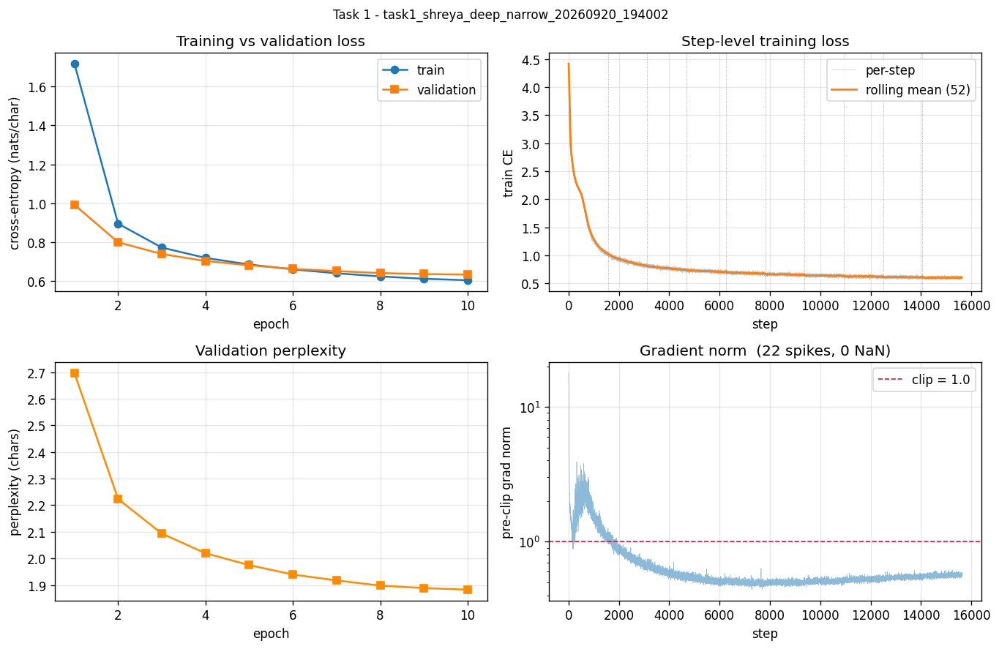
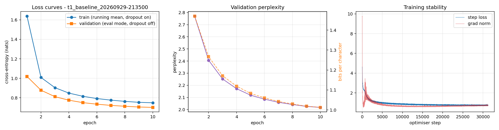
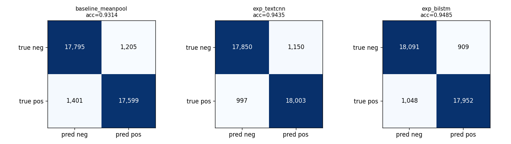
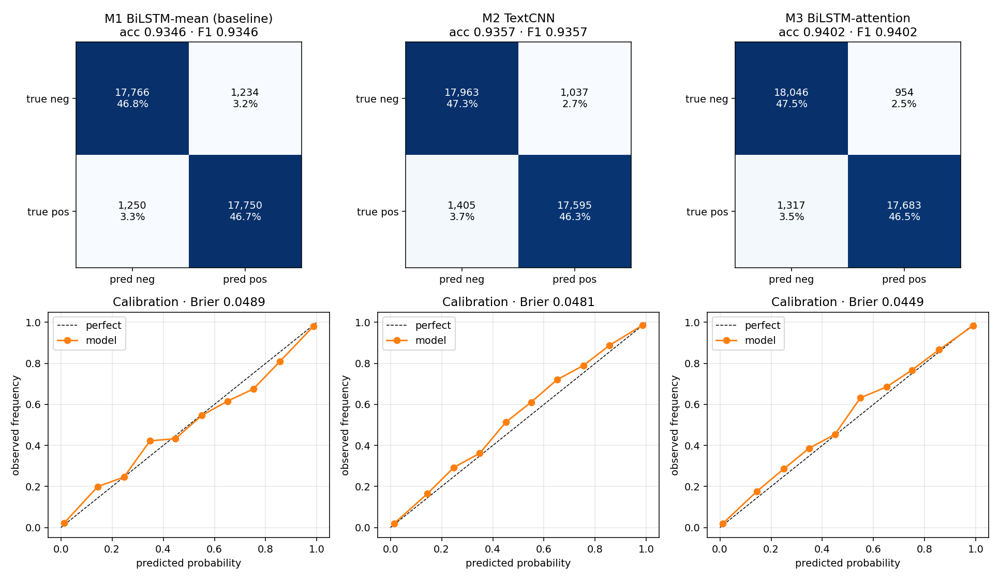
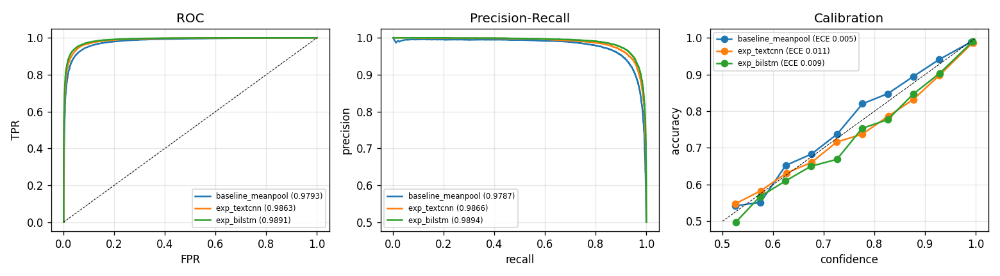
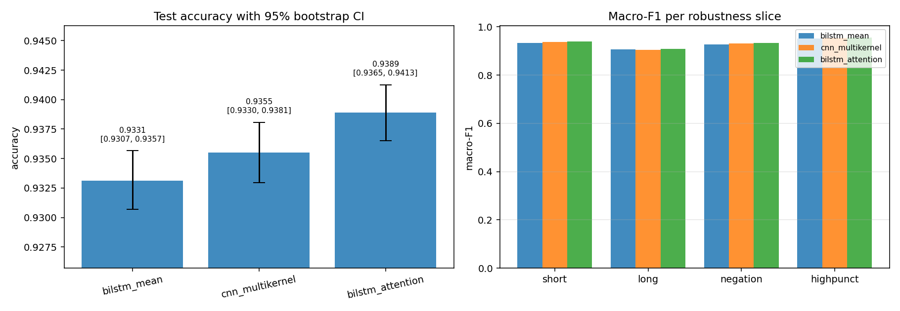
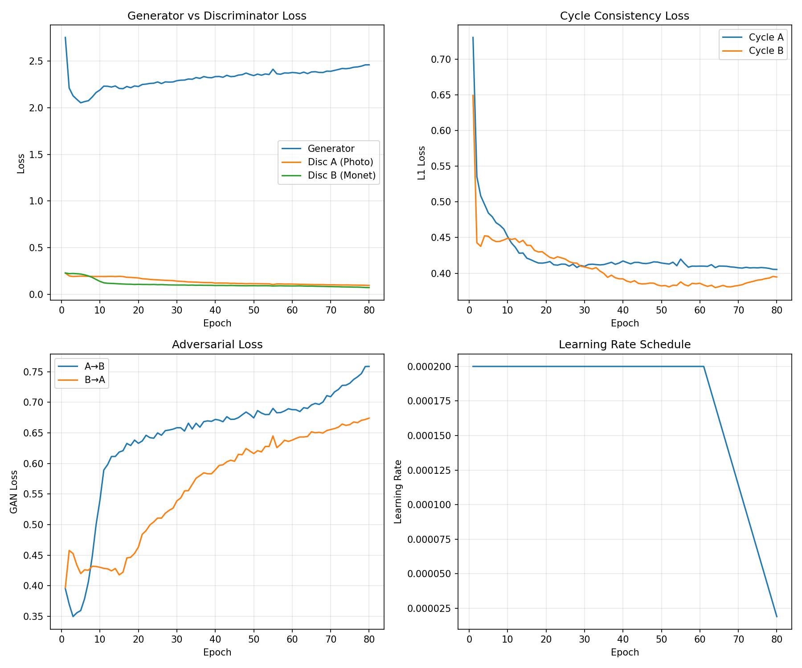
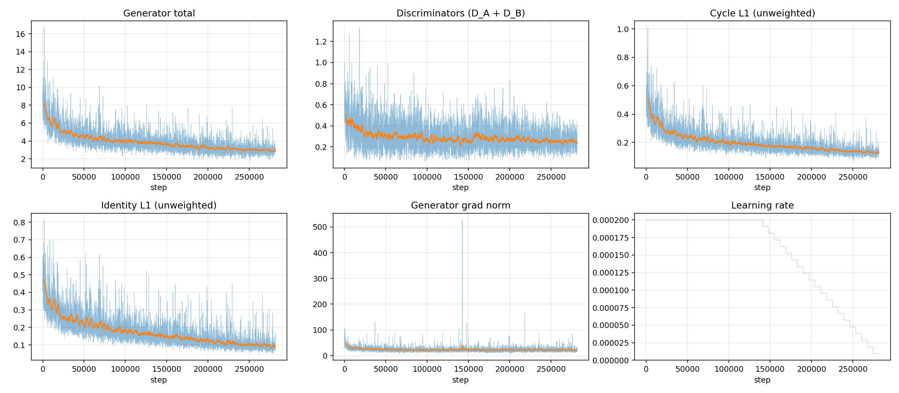
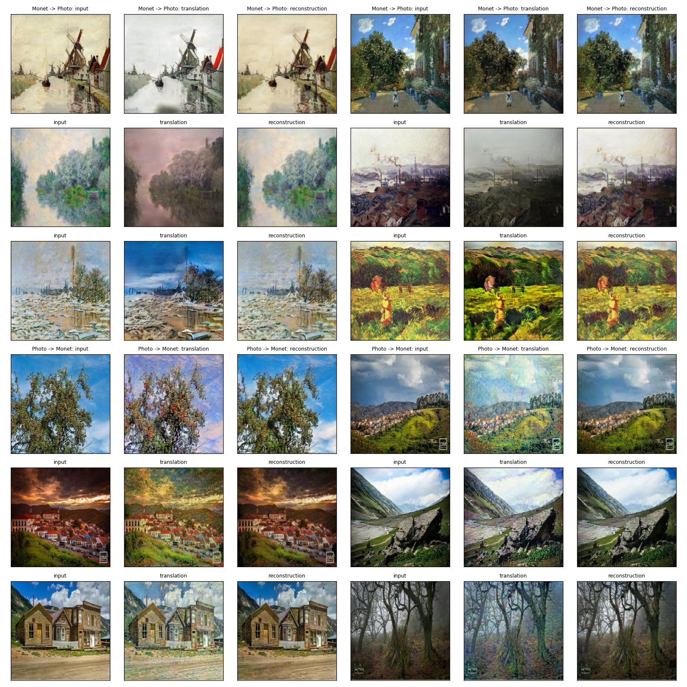

# DATA 266 Lab 1 — Team 32 Report

**Team members:** Shreya Akotiya (`shreya_akotiya`), Zoheb Waghu (`zoheb_waghu`)  
**Repository:** https://github.com/sakotiya/data266-lab1

## Team ownership statement

Each of us designed, implemented, trained, and evaluated our own models in our own folders. We
kept our code and experiment results separate, then compared the results after both members had
finished their runs.

Before training, we agreed on the main shared decisions. We interpreted 100K/10K as the number
of sequences, used non-overlapping data slices for Task 1, built vocabularies from training data
only, and used the same `metrics_report.csv` format. This made it easier to place our results
side by side. The comparison sections below summarize what we found together.

### Individual contributions

**Shreya's contribution**

I built and trained the 12-layer deep-narrow character GPT for Task 1. I also trained three Yelp
sentiment models for Task 2: a mean-pooling baseline, a TextCNN, and a BiLSTM. For Task 3, I
trained a CycleGAN with UNet generators and PatchGAN discriminators. My work is
organized around configuration-driven notebooks, and I prepared the preprocessing, training
logs, metrics, generated samples, and failure analyses for my models.

**Zoheb's contribution**

I built and trained the 4-layer shallow-wide character GPT for Task 1. For Task 2, I trained a
BiLSTM mean-pooling baseline, a TextCNN, and an attention-based BiLSTM. For Task 3, I trained a
CycleGAN with ResNet-9 generators and 70 × 70 PatchGAN discriminators. I organized my work using
Python source modules and notebooks, and prepared the checkpoints, metrics, plots, logs, and
error reviews for my models.

We agreed to use the same main evaluation format so that the results could be compared fairly.

---

## Task 1 — GPT-style character language model from scratch

### 1.1 Shared setup

Both models follow the same rules, so differences between them come from the design choices in
§1.2.

- **Data.** TinyStories, character-level. Both members read the same raw file at **different,
  non-overlapping offsets**: Shreya chars `[0, 34M)`, Zoheb chars from `34M`. Each member
  therefore has their own train/validation split.
- **Split size.** "Training (100K) and validation (10K)" is read as **sequences** of 256
  characters: 100,000 train sequences (25.6M characters) and 10,000 validation sequences
  (2.56M characters). Targets are inputs shifted by one.
- **Vocabulary.** Own `char_to_idx` / `idx_to_char`, built from the training split only, with an
  `<unk>` slot for unseen characters.
- **No prebuilt Transformer modules.** Attention (Q/K/V projections, scaled dot product,
  causal mask, softmax, head split/merge), LayerNorm placement, feed-forward, residuals, token and
  positional embeddings and the LM head are all hand-written. Neither code base uses
  `nn.Transformer*`, `nn.MultiheadAttention` or fused scaled-dot-product attention.
- **Causal mask verified behaviourally.** Both members changed the token at position j and
  confirmed that the logits at every position before j are bit-identical, while logits from j
  onward change.
- **Training.** Cross-entropy loss, AdamW (β = 0.9, 0.95, weight decay 0.1), linear warm-up
  followed by cosine decay, gradient clipping at 1.0, 10 epochs.
- **Generation.** Greedy decoding and temperature sampling from the prompt "Once upon a time".

### 1.2 Model comparison — architecture and hyperparameters

The two models are the team's depth-vs-width comparison: a deep-narrow model against a
shallow-wide one at the same embedding width and the same number of training tokens.

| | **shreya_akotiya** | **zoheb_waghu** |
|---|---|---|
| Design idea | deep-narrow | shallow-wide |
| Transformer blocks | **12** | **4** |
| Attention heads (dims/head) | 8 (32) | 4 (64) |
| Embedding width `d_model` | 256 | 256 |
| Feed-forward width | 1024 (4×) | 1024 (4×), GELU |
| Normalisation | pre-LN | pre-LN |
| Positional encoding | learned | learned |
| Context length | 256 | 256 |
| Vocabulary size | 78 | 97 |
| Dropout | 0.05 | 0.1 |
| **Parameters** | **9,570,816** | **3,274,752** |
| Batch size (tokens/step) | 64 (16,384) | 32 (8,192) |
| Steps (per epoch / total) | 1,562 / 15,620 | 3,125 / 31,250 |
| Peak → min learning rate | 2.5e-4 → 2.5e-5 | 3e-4 → 3e-5 |
| Warm-up | 781 steps (5%) | 1,000 steps (~3%) |
| Epochs | 10 | 10 |
| Training tokens seen | 256M | 256M |
| Seed | 1337 | 1337 |
| Hardware | NVIDIA Tesla T4 16 GB (Google Colab), CUDA, PyTorch 2.11 | NVIDIA GeForce RTX 4090 24 GB, AMD Ryzen 9 7950X, CUDA, PyTorch 2.5.1 |

The two models also differ in dropout, batch size, learning rate and head size, not only in
depth. The comparison is therefore **deep-narrow vs shallow-wide as complete designs**, not a
controlled ablation of depth alone.

### 1.3 Metrics — side by side

All numbers are from each member's `metrics_report.csv` (team schema) and
`metrics_report_extended.csv`. Cross-entropy is in nats per character on each member's own
10K-sequence validation split.

| Metric | **shreya_akotiya** | **zoheb_waghu** |
|---|---|---|
| Training cross-entropy (eval mode, best checkpoint) † | 0.6038 | 0.6982 |
| Validation cross-entropy (best) | **0.6327** | 0.7019 |
| Perplexity | **1.883** | 2.018 |
| Bits-per-character | **0.913** | 1.013 |
| Generalization gap (val − train) | 0.0289 | **0.0037** |
| Top-1 next-character accuracy | **79.9%** | 77.7% |
| Distinct-1 / 2 / 3 (character) ‡ | 0.0029 / 0.0286 / 0.1247 | 0.0125 / 0.0997 / 0.2832 |
| Repeated 4-gram rate (character) ‡ | 0.721 | 0.559 |
| Gradient norm mean / max | 0.687 / 17.79 | 0.744 / 9.77 |
| Loss spikes † | 22 | 0 |
| NaN / Inf events | 0 | 0 |
| Parameter count | 9,570,816 | 3,274,752 |
| Training throughput (tokens/sec) ¶ | 24,209 (T4) | 663,173 (RTX 4090) |
| Generation throughput (tokens/sec) ¶ | 87.6 | 507.6 |
| Peak GPU memory (`torch.cuda.max_memory_allocated`) | 8.06 GB | 0.99 GB |
| Total training time ¶ | 176.2 min | 6.4 min |
| Best epoch | 10 (last) | 10 (last) |

**Comparability notes**

- † **Training cross-entropy is not the number the loss curves end on.** Both members' values
  here are measured in **eval mode** (dropout off) on the best checkpoint, which is what
  `metrics_report.csv` stores. The per-epoch training curve in §1.4 is a running mean of
  minibatch losses *during* the epoch with dropout **active** and weights still changing, so it
  ends higher - Zoheb's curve ends at 0.749 against 0.698 here. Measured on his checkpoint over
  the same 300 training batches, changing only `model.train()` vs `model.eval()`, gives 0.733 vs
  0.684: dropout accounts for 0.0496 of the 0.0511 difference and within-epoch improvement for
  the remaining 0.0015. Validation agrees exactly between curve and table (0.7019), which rules
  out a plotting error. The generalization gap row compares eval mode with eval mode.
- ‡ **Diversity metrics are not directly comparable.** Both use the same formula (unique
  n-grams ÷ total n-grams over characters), but Shreya's are measured on 20,000 generated
  characters at T = 1.0 and Zoheb's on ~3,600 characters pooled over greedy, T = 0.8 and T = 1.2.
  Distinct-n falls and repeated-n-gram rate rises as the text gets longer, so the gap between the
  columns mostly reflects sample length, not model quality.
- † **Loss spikes use different detectors.** Shreya flags a step whose loss exceeds the rolling
  mean by 3σ (100-step window); her 22 spikes are each about 7% above the local mean. Zoheb flags
  a loss above 2× the running median, a much looser threshold that none of Shreya's spikes would
  meet. Both runs are stable by either definition: no NaNs, and validation loss improved every
  epoch.
- ¶ **Speed is not comparable.** Shreya trained on a Tesla T4 and Zoheb on an RTX 4090, a much
  faster GPU, so throughput and training time mostly reflect the hardware, not the models.
- **Peak memory is comparable.** Both runs measure it with `torch.cuda.max_memory_allocated`.
  The 8× difference comes from the deeper model (12 vs 4 blocks of stored activations) and the
  larger batch (64 vs 32).
- The two validation sets are different slices of TinyStories, so the loss comparison is close
  but not paired.

### 1.4 Training curves

**shreya_akotiya (12 × 256):**

**zoheb_waghu (4 × 256):**

Validation loss per epoch:

| Epoch | 1 | 2 | 3 | 4 | 5 | 6 | 7 | 8 | 9 | 10 |
|---|---|---|---|---|---|---|---|---|---|---|
| shreya — val bpc | 1.431 | 1.153 | 1.066 | 1.014 | 0.982 | 0.956 | 0.939 | 0.924 | 0.917 | **0.913** |
| zoheb — val bpc | 1.470 | 1.267 | 1.171 | 1.119 | 1.083 | 1.060 | 1.042 | 1.030 | 1.019 | **1.013** |

Both curves fall at every epoch and both models reach their best validation loss at the last
epoch. The deeper model is ahead from epoch 1, and the gap between the two models grows from
0.04 bpc at epoch 1 to about 0.10 bpc by epoch 10.

### 1.5 Joint analysis

**What we noticed from the comparison**

1. **The deeper model performed better on next-character prediction.** The 12-layer model reached
   0.913 bits per character and 79.9% next-character accuracy, compared with 1.013 bits per
   character and 77.7% accuracy for the 4-layer model. The difference makes sense for this
   task because a character model has to build characters into words, words into phrases, and
   phrases into sentences. The extra layers give it more steps to do that.
2. **The deeper model also costs more.** It has about 2.9 times as many parameters and used about
   eight times more peak GPU memory. The two training times cannot be compared directly,
   because Shreya's run used a Tesla T4 while Zoheb's used an RTX 4090.
3. **The smaller model had a smaller generalization gap, but that does not mean it learned more.**
   Its gap was 0.0037 compared with 0.0289 for the deeper model. The smaller gap mostly reflects the lower
   capacity of the shallow model: it fit the training data less closely as well as the validation
   data.
4. **Neither model had fully converged after 10 epochs.** Validation loss was still improving at
   the end of both runs, so the final epoch was still the best checkpoint. Ten epochs was the
   training limit, not the point where either model had completely finished learning.
5. **Both runs were stable.** Neither model produced NaN or Inf values. The largest gradient norm,
   17.8, occurred at the beginning of the deeper model's training. After warm-up, its maximum was
   2.9, and no step after step 1,910 needed clipping.

**Strengths**

- Both implementations pass a behavioural causal-mask test, not only a visual one.
- Both produce fluent, correctly spelled English at low temperature, with correct word
  boundaries, punctuation, quotation marks and the typical TinyStories structure.
- Disjoint data slices give each member a genuinely separate train/validation split.

**Weaknesses and shared failure modes**

The two models fail in the same ways, which suggests the failures come from the shared setup
(character-level next-token prediction, 256-character context, small model, no decoding
constraints) rather than from either design.

| Failure type | shreya_akotiya example | zoheb_waghu example |
|---|---|---|
| Repetition under greedy decoding | repeats "Once upon a time, there was a little girl named Lily." | "The box was so happy and the box was so happy to see the box." |
| Semantic contradiction / impossible meaning | "Lily was happy to hear that her mom was sad." | "Her pocket seemed sad to melt." |
| Losing track of who is who | "Lily didn't want to share his toy friends" | restarts a new story mid-generation ("Once upon a time…") |
| Non-words at high temperature | "strets", "pumpins", "knowled" (3.0% non-words at T = 1.2) | "aboven", "MPleaf", "spreadying" at T = 1.2 |

In both models, temperature moves the problem from one type of failure to another. Greedy and
low-temperature decoding usually give cleaner spelling, but the model can repeat common phrases.
Higher temperatures reduce repetition, but they also increase spelling and meaning errors. In Shreya's
temperature sweep, T = 0.8 gave the best balance: the non-word rate was only 0.42% and no repeated
phrase was detected. Zoheb saw the same general pattern: his repeated 4-gram rate decreased as
the temperature increased, but the semantic problems became more noticeable at T = 1.2.

**Limitations**

- Single seed per model, so there is no variance estimate.
- The two models differ in several hyperparameters at once (see §1.2), so the quality gap cannot
  be attributed to depth alone.
- The diversity and loss-spike metrics were computed with different sample sizes and detectors
  (see §1.3).
- The 256-character context is shorter than most stories, so neither model can keep a story
  consistent from start to finish.
- Generation uses no KV cache, so throughput figures understate what the models could do.

**What the team would try next**

1. **Train longer.** Both curves were still falling. We expect 15–20 epochs to lower validation
   loss further for both, with the deep model's gap growing first.
2. **Controlled depth ablation.** Train 256 × 4 and 256 × 12 with the same batch size, learning
   rate, dropout and seed, to isolate the effect of depth.
3. **Top-k / nucleus sampling (p ≈ 0.9).** Cutting the low-probability tail should keep the
   diversity of higher temperatures while avoiding their non-words, and should break greedy
   loops.
4. **Longer context (512–1024)** and masking at story boundaries, targeting the coherence and
   story-restart failures that decoding changes cannot fix.
5. **Unified evaluation script.** Re-score both models' diversity on the same number of
   characters at the same temperature, with one loss-spike definition.

### 1.6 Individual failure analyses

Full write-ups with verbatim snippets are in each member's folder:

- `task1_llm/shreya_akotiya/failure_analysis.md`:
    1. semantic contradiction (greedy);
    2. pronoun and reference confusion (T = 0.5);
    3. non-words at high temperature (T = 1.0);
    4. the temperature trade-off across greedy to T = 1.2.
- `task1_llm/zoheb_waghu/failure_analysis.md`:
    1. phrase-level repetition loop (greedy);
    2. invalid words and semantic breakdown at high temperature (T = 1.2);
    3. story-boundary confusion: restarting a new story mid-generation (greedy).

### 1.7 Evidence

| | shreya_akotiya | zoheb_waghu |
|---|---|---|
| Run ID | `task1_shreya_deep_narrow_20260920_194002` | `t1_baseline_20260929-213500` |
| Config | `task1_llm/shreya_akotiya/config.yaml` | `task1_llm/zoheb_waghu/configs/gpt_baseline.yaml` |
| Checkpoint | `task1_llm/shreya_akotiya/checkpoints/task1_shreya_deep_narrow_20260920_194002_best.pt` (sha256 `f540786b…`) | `task1_llm/zoheb_waghu/checkpoints/t1_baseline_20260929-213500_best.pt` (sha256 `6b7ecfe1…`) |
| Raw log | `reproducibility/raw_logs/shreya_akotiya/task1_llm/task1_shreya_deep_narrow_20260920_194002.log` | `reproducibility/raw_logs/zoheb_waghu/task1_llm/t1_baseline_20260929-213500.log` (+ `.jsonl`) |
| Manifest | `reproducibility/manifests/shreya_akotiya/task1_shreya_deep_narrow_20260920_194002.json` | `reproducibility/manifests/zoheb_waghu/task1_llm_manifest.md` |
| Loss curves | `outputs/plots/loss_curves.png` | `outputs/plots/loss_curves_t1_baseline_20260929-213500.png` |
| Samples | `outputs/samples/{greedy,T0.5,T0.8,T1.0,T1.2}.txt` | `outputs/samples/samples_t1_baseline_20260929-213500.txt` |
| Causal-mask check | `outputs/plots/causal_mask_check.png` | `src/evaluate.py::causal_mask_probe` (logged in run) |
| Metrics | `metrics_report.csv`, `metrics_report_extended.csv` | `metrics_report.csv`, `metrics_report_extended.csv` |

---

## Task 2 — Yelp Polarity sentiment classification

### 2.1 Shared setup

- **Dataset: Yelp Polarity** (confirmed), with 560,000 training and 38,000 test reviews,
  binary and exactly balanced.
- **Same test set.** Both members evaluate on the **full official 38,000-review test split**,
  touched once, at the end. Because the test set is identical, the test metrics below are
  directly comparable across members, unlike Task 1, where each member had their own
  validation slice.
- **Validation is held out from the training split** in both pipelines. Each member's three
  models share one split and one vocabulary, so the paired McNemar tests within a member are
  valid.
- **No pretrained embeddings or language models.** Every model uses an `nn.Embedding`
  initialised randomly and trained end to end.
- **Negation words are kept.** Both members remove stopwords but exempt negation words (`not`,
  `no`, `never`, `n't` forms), because removing them would turn "not good" into "good".
- **Same metric set.** Both pipelines report accuracy, precision/recall/F1 (macro, micro and
  weighted), confusion matrix, ROC-AUC, PR-AUC, MCC, Brier score, ECE, 95% bootstrap CIs, paired
  McNemar against the member's baseline, per-slice macro-F1 and error rate, parameter count,
  training time, examples/sec and peak GPU memory.

### 2.2 Preprocessing — side by side

| | **shreya_akotiya** | **zoheb_waghu** |
|---|---|---|
| Training data used | **all 540,000** (+ 20,000 validation) | **89,997** subsample (+ 9,999 validation) |
| Test | full 38,000 | full 38,000 |
| Malformed rows dropped | 0 train / 0 test (none found; 35 reviews empty after cleaning, kept as padding) | 4 train / 0 test |
| Lowercase, strip punctuation/special characters | yes | yes |
| Contractions | apostrophe removed (`don't` → `dont`), kept as a negation word | expanded before stopword removal (`don't` → `do not`) |
| Stopword list | sklearn (318); 13 negation words exempted → 305 removed | NLTK (198); 39 negation words exempted → 158 removed |
| Word normalisation | light suffix stemming (`-s`, `-ed`, `-ing`, `-ly`, …) | WordNet lemmatisation |
| Vocabulary | 48,436 words (min frequency 5, cap 50K), 99.47% token coverage | 30,000 words (min frequency 2, cap 30K), 1.28% test OOV |
| Max length (tokens) | 200: keeps 96.6% of reviews whole | 256: keeps 97.8% of reviews whole |
| Embedding dimension | 200 (all three models) | 128 (M1, M2) / 256 (M3) |

EDA findings both members recorded: the data is perfectly balanced, and review length is
right-skewed (a long tail of reviews over 500 words). Shreya also found that **negative reviews
are longer** (median 112 vs 84 words).

### 2.3 Models — architecture and hyperparameters

Each member trained one baseline and two experimental models. No two of the six share an
architecture and hyperparameter set.

| | Model | Encoder | Pooling | Params | Dropout | Optimiser / LR | Batch / epochs |
|---|---|---|---|---|---|---|---|
| **Shreya** | **Baseline** — mean-pool | none (bag of embeddings) | masked mean | 9,687,602 | 0.3 | Adam 1e-3 | 256 / 3 |
| | Exp. 1 — TextCNN | Conv1d, widths 3/4/5 × 100 filters | max over time | 9,928,102 | 0.5 | Adam 1e-3 | 256 / 3 |
| | Exp. 2 — BiLSTM | 1-layer BiLSTM, hidden 128 | masked max over time | 10,025,634 | 0.3 | Adam 1e-3 | 256 / 3 |
| **Zoheb** | **Baseline** — BiLSTM-mean | 1-layer BiLSTM, hidden 128 | masked mean | 4,104,449 | 0.3 | Adam 1e-3 | 64 / 8 (early stop) |
| | Exp. 1 — TextCNN | Conv1d, widths 2/3/4/5 × 128 filters | max over time | 4,135,681 | 0.5 | Adam 1e-3, wd 1e-5 | 64 / 8 (early stop) |
| | Exp. 2 — BiLSTM-attention | 2-layer BiLSTM, hidden 256 | additive (Bahdanau) attention | 10,441,217 | 0.4 | AdamW 2e-3, cosine, 300-step warm-up | 32 / 12 (early stop) |

**Design logic.**

- **Shreya's set adds sequence information step by step at a fixed embedding size:** no word
  order (mean-pool), then local n-grams (TextCNN), then full-sequence state (BiLSTM).
- **Zoheb's set starts from a sequential baseline** and tests two changes: replacing recurrence
  with convolutions (TextCNN), and replacing mean pooling with learned attention (BiLSTM-attn).
- **Model selection.** Both members keep the checkpoint with the best validation score. Every
  model peaked within the first one to three epochs: Shreya's at epochs 2–3 of 3, and Zoheb's
  early stopping chose epoch 1–2.

### 2.4 Metrics — all six models on the same 38K test set

| Metric | S: mean-pool | S: TextCNN | S: BiLSTM | Z: BiLSTM-mean | Z: TextCNN | Z: BiLSTM-attn |
|---|---|---|---|---|---|---|
| Accuracy | 0.9314 | 0.9435 | **0.9485** | 0.9346 | 0.9357 | 0.9402 |
| Precision (macro) | 0.9315 | 0.9435 | **0.9485** | 0.9346 | 0.9359 | 0.9404 |
| Recall (macro) | 0.9314 | 0.9435 | **0.9485** | 0.9346 | 0.9357 | 0.9402 |
| F1 (macro) | 0.9314 | 0.9435 | **0.9485** | 0.9346 | 0.9357 | 0.9402 |
| F1 (micro) | 0.9314 | 0.9435 | **0.9485** | 0.9346 | 0.9357 | 0.9402 |
| F1 (weighted) | 0.9314 | 0.9435 | **0.9485** | 0.9346 | 0.9357 | 0.9402 |
| ROC-AUC | 0.9793 | 0.9863 | **0.9891** | 0.9830 | 0.9836 | 0.9853 |
| PR-AUC | 0.9787 | 0.9866 | **0.9894** | 0.9835 | 0.9840 | 0.9856 |
| MCC | 0.8629 | 0.8870 | **0.8970** | 0.8693 | 0.8716 | 0.8806 |
| Brier score | 0.0516 | 0.0430 | **0.0384** | 0.0489 | 0.0481 | 0.0449 |
| ECE ‡ | **0.0046** | 0.0111 | 0.0086 | 0.0134 | 0.0054 | 0.0088 |
| Confusion TN / FP | 17,795 / 1,205 | 17,850 / 1,150 | 18,091 / 909 | 17,766 / 1,234 | 17,963 / 1,037 | 18,046 / 954 |
| Confusion FN / TP | 1,401 / 17,599 | 997 / 18,003 | 1,048 / 17,952 | 1,250 / 17,750 | 1,405 / 17,595 | 1,317 / 17,683 |
| Accuracy 95% CI | [0.9289, 0.9339] | [0.9412, 0.9458] | [0.9463, 0.9507] | [0.9321, 0.9371] | [0.9333, 0.9383] | [0.9379, 0.9426] |
| Macro-F1 95% CI | [0.9289, 0.9339] | [0.9412, 0.9458] | [0.9463, 0.9507] | [0.9321, 0.9371] | [0.9333, 0.9383] | [0.9379, 0.9426] |
| MCC 95% CI | [0.8578, 0.8679] | [0.8824, 0.8915] | [0.8926, 0.9014] | [0.8642, 0.8741] | [0.8667, 0.8767] | [0.8760, 0.8855] |
| McNemar p vs own baseline | – | **1.6e-24** | **9.4e-55** | – | 0.369 (n.s.) | **2.6e-7** |
| Parameters | 9.69M | 9.93M | 10.03M | 4.10M | 4.14M | 10.44M |
| Training time ¶ | 41 s | 248 s | 350 s | 19 s | 17 s | 436 s |
| Examples/sec ¶ | 39,502 | 6,547 | 4,637 | 18,569 | 21,723 | 825 |
| Peak GPU memory | 338 MB | 460 MB | 2,286 MB | 1,280 MB | 219 MB | 1,526 MB |
| Hardware | Tesla T4 | Tesla T4 | Tesla T4 | RTX 4090 | RTX 4090 | RTX 4090 |

Micro-F1 equals accuracy for single-label classification. Macro and weighted F1 are almost
identical to it because the test set is exactly balanced.

**Comparability notes**

- ¶ **Speed is not comparable across members.** Shreya trained on a Tesla T4 (Google Colab) and
  Zoheb on an RTX 4090. Training time also depends on training-set size (540K vs 90K reviews)
  and epoch count. Peak memory is comparable: both use `torch.cuda.max_memory_allocated`.
- ‡ **ECE uses different bin counts** (10 bins for Shreya, 15 for Zoheb), so small ECE
  differences across members are not meaningful. Brier score has no such parameter and is
  directly comparable.
- Bootstrap CIs use 1,000 resamples (Shreya) and 2,000 (Zoheb). This affects the CI estimates
  only slightly.

**Confusion matrices (Shreya):**

**Confusion matrices and calibration (Zoheb):**

**ROC, PR and calibration curves (Shreya):**

**Model comparison (Zoheb):**

### 2.5 Per-slice robustness

Each member defined their own slices, so the numbers within a member's set are comparable, and
across members only the trends are.

**Shreya** (lengths in processed tokens; negation detected after preprocessing). Each cell is
macro-F1 / error rate.

| Slice (n) | mean-pool | TextCNN | BiLSTM |
|---|---|---|---|
| ≤ 40 tokens (16,731) | 0.931 / 6.8% | 0.943 / 5.6% | 0.949 / 5.0% |
| 41–100 tokens (14,542) | 0.932 / 6.8% | 0.945 / 5.4% | 0.949 / 5.1% |
| > 100 tokens (6,727) | 0.924 / 7.2% | 0.934 / 6.3% | 0.941 / 5.6% |
| has negation (28,544) | 0.924 / 7.4% | 0.940 / 5.9% | 0.945 / 5.3% |
| no negation (9,456) | 0.927 / 5.3% | 0.930 / 5.0% | 0.936 / 4.6% |

**Zoheb** (lengths in tokens; negation detected in the raw review). Each cell is macro-F1 /
error rate.

| Slice (n) | BiLSTM-mean | TextCNN | BiLSTM-attn |
|---|---|---|---|
| short, ≤ 50 tokens (18,860) | 0.935 / 6.4% | 0.936 / 6.3% | 0.941 / 5.9% |
| long, > 200 tokens (1,697) | 0.915 / 7.5% | 0.908 / 8.0% | 0.919 / 7.1% |
| contains negation (22,583) | 0.929 / 6.6% | 0.931 / 6.4% | 0.936 / 5.9% |
| ≥ 3 exclamation marks (6,944) | 0.955 / 4.4% | 0.952 / 4.7% | 0.958 / 4.1% |

**Shared findings.**

- **Long reviews are the weakest slice for all six models.** Long reviews are more often mixed
  (praise and complaint in one review), and a few lose their tail to truncation. Each member's
  strongest model (Shreya's BiLSTM, Zoheb's BiLSTM-attn) stays the most accurate on long
  reviews, although it is not the one whose score drops least. In both sets the TextCNN drops
  most (Shreya: +0.7–0.9 error points; Zoheb: 0.936 → 0.908 macro-F1), consistent with
  fixed-width filters losing long-range contrast.
- **Reviews with a negation are harder for every model**, but keeping negation words limits the
  damage. The penalty is largest for the model with no word order: Shreya's mean-pool error
  rate rises 2.1 points from the no-negation to the negation slice, against 0.7–0.8 points for
  her TextCNN and BiLSTM. Zoheb's models lose about 0.5 macro-F1 points on the negation slice
  relative to their overall score.
- **Strongly emotional reviews (≥ 3 exclamation marks) are the easiest slice** in Zoheb's
  analysis (error rate 4.1–4.7%), because they carry unambiguous sentiment.

### 2.6 Joint analysis

**What we learned from the comparison**

1. **The BiLSTM trained by Shreya had the highest test accuracy at 94.85%.** Its confidence
   interval did not overlap Zoheb's best BiLSTM-attention interval. However, architecture alone
   cannot explain the difference. Shreya's models used 540K training reviews, while Zoheb used
   90K, and the vocabulary and embedding sizes were also different. The difference in training-set
   size is probably the most important factor.
2. **Keeping word order helped.** Shreya's mean-pooling baseline was the weakest of her three
   models at 93.14%, while both the TextCNN and BiLSTM performed better. Zoheb's baseline was
   already a BiLSTM, which is why it started at 93.46% even with less training data.
3. **TextCNN was especially useful compared with a bag-of-words model.** Shreya's TextCNN improved
   over her mean-pooling baseline by 1.2 percentage points, and the McNemar test confirmed that
   the improvement was significant. In Zoheb's experiments, however, TextCNN was not significantly
   better than his BiLSTM baseline. This suggests that local phrase features help most when the
   baseline does not understand word order at all.
4. **Attention pooling improved Zoheb's BiLSTM.** The attention BiLSTM improved over the mean-
   pooling BiLSTM by 0.56 percentage points. It also required much more computation. Shreya's BiLSTM
   masked max-pooling model reached a higher score, but the two results are not a perfectly
   controlled pooling comparison because the training data and embedding sizes were different.
5. **The probability outputs were generally useful.** All models had reasonably low Brier scores
   and ECE values. Within each member's experiments, the model with the best accuracy also had the
   best Brier score.
6. **Most models reached their best validation result early.** The models usually peaked within
   the first few epochs. This suggests that future improvements should focus more on the amount of
   data, input length, and model design than simply adding many more epochs.

**Strengths**

- All six models exceed 93% accuracy with embeddings learned entirely from scratch.
- Every claim is backed by a significance test (CIs plus paired McNemar), not by point
  estimates alone.
- The negation handling is measured: both members report a negation slice, and the
  bag-of-words model's larger negation penalty shows why negations had to be kept.

**Weaknesses and limitations**

- **Confounded comparison across members.** Training-set size, vocabulary, embedding size,
  preprocessing (stemming vs lemmatisation) and hardware all differ between the two sets, so
  cross-member differences cannot be attributed to any single factor.
- **Single seed per model**, so there is no estimate of run-to-run variance.
- **Slices were defined independently** (different length cut-offs and negation detectors) and
  ECE bins differ, so those numbers are not fully comparable across members.
- **Label noise.** Both error reviews found reviews whose text clearly contradicts their gold
  label (rating-text mismatch), which caps achievable accuracy.
- **Truncation** at 200 / 256 tokens cuts the end of the ~2–3% longest reviews, where the
  final verdict often sits.

**What the team would try next**

1. **A controlled cross-member test.** Train Zoheb's BiLSTM-attn on Shreya's full 540K split
   (or Shreya's BiLSTM on Zoheb's 90K split) to separate the effect of data size from the
   effect of architecture.
2. **A paired McNemar test between the two best models.** Both members scored the same 38K test
   reviews, so a paired test of Shreya's BiLSTM against Zoheb's BiLSTM-attn is possible once the
   prediction files are aligned by row.
3. **A hierarchical or sentence-level encoder** for long, mixed reviews. Both error reviews
   identify mixed sentiment as a leading error type, and the long-review slice is the weakest
   for all six models.
4. **Shared evaluation code.** Use the same slice definitions, ECE bins and bootstrap count, so
   every robustness number is comparable.
5. **Multiple seeds** (e.g. 3 per model) to put variance bars on the close calls, such as
   Zoheb's TextCNN vs his baseline.

### 2.7 Individual error reviews

Each member manually reviewed 20 errors from one of their own models: 5 confident false
positives, 5 confident false negatives, 5 near-threshold errors and 5 slice-specific errors.
Each error has a type and a testable fix.

| | **shreya_akotiya** | **zoheb_waghu** |
|---|---|---|
| Model reviewed | BiLSTM (best, 94.85%) | BiLSTM-mean baseline (93.46%) |
| Slice used for the last 5 | reviews containing a negation | long reviews (> 200 tokens), the worst slice |
| Most common error types | mixed sentiment / split verdicts, temporal shifts ("EDIT: now much better"), negation scope (negation of a competitor, a requirement or a past state), sarcasm | **mixed sentiment (12 of 20)**, rating-text mismatch (2), domain term (2), length truncation (2), negation (1), sarcasm (1) |
| Proposed fix | phrase- or aspect-level sentiment aggregation; parse negation scope; recency weighting | chunked hierarchical sentence encoder over up to 512 tokens, measured on long-review macro-F1 |
| Full write-up | `task2_sentiment/shreya_akotiya/failure_analysis.md` | `task2_sentiment/zoheb_waghu/failure_analysis.md`, `outputs/error_review_t2_m1_baseline.md` |

Both reviews reach the same conclusion from different models. The remaining errors are mostly
**discourse-level**: mixed or changing sentiment within one review, sarcasm, and negations whose
scope is not the review's subject. A single pooled vector cannot represent these. Both members
also found label noise, which no model can fix.

### 2.8 Evidence

| | shreya_akotiya | zoheb_waghu |
|---|---|---|
| Run IDs | `task2_shreya_main_20260921_222011` (all three models) | `t2_m1_baseline_20260929-211318`, `t2_m2_cnn_20260929-211446`, `t2_m3_bilstm_attn_20260929-211521` |
| Config | `task2_sentiment/shreya_akotiya/config.yaml` | `task2_sentiment/zoheb_waghu/configs/` (`_shared.yaml` + one per model) |
| Checkpoints | `task2_sentiment/shreya_akotiya/checkpoints/{baseline_meanpool,exp_textcnn,exp_bilstm}.pt` | `task2_sentiment/zoheb_waghu/checkpoints/t2_m{1,2,3}_…_best.pt` |
| Raw logs | `reproducibility/raw_logs/shreya_akotiya/task2_sentiment/task2_shreya_main_20260921_222011.log` | `reproducibility/raw_logs/zoheb_waghu/task2_sentiment/t2_m*_20260929-*.log` (+ `.jsonl`) |
| Manifest | `reproducibility/manifests/shreya_akotiya/task2_shreya_main_20260921_222011.json` | `reproducibility/manifests/zoheb_waghu/task2_sentiment_manifest.md` |
| Metrics | `metrics_report.csv`, `metrics_report_extended.csv`, `outputs/slice_metrics.csv`, `outputs/mcnemar.csv` | `metrics_report.csv`, `metrics_report_extended.csv` |
| Plots | `outputs/plots/{eda,confusion_matrices,curves}.png` | `outputs/plots/{eda_overview,model_comparison}.png`, `outputs/confusion_matrices/confusion_and_calibration.png` |
| Error review | `failure_analysis.md`, `outputs/error_review.md` | `failure_analysis.md`, `outputs/error_review_t2_m1_baseline.md` |

---

## Task 3 — CycleGAN image style transfer (Monet ↔ photo)

### 3.1 Shared setup

- **Data.** Kaggle `gan-getting-started`: 300 Monet paintings and 7,038 photographs, unpaired,
  256 × 256. Both members trained at full 256px resolution, with the same augmentation: resize to
  286, random 256 crop, horizontal flip.
- **Direction names.** This report uses the instructor's convention: **A = Monet, B = photo**.
  So **A2B = Monet → photo** and **B2A = photo → Monet** (the Kaggle direction). Shreya's
  notebook internally uses A = photo, so her `outputs/pred_A2B/` folder holds photo → Monet. All
  tables below use the instructor's names.
- **Same CycleGAN recipe.** Both models have two generators and two discriminators, trained with
  an LSGAN adversarial loss, cycle-consistency loss (λ = 10 in both directions), identity loss
  (0.5 × λ = 5), a 50-image fake pool for each discriminator, Adam (lr 2e-4, β = (0.5, 0.999)),
  batch size 1 with instance normalisation, and one epoch = one pass over the 7,038 photos (each
  Monet image is reused about 23 times per epoch).
- **Same evaluation.** All image-quality numbers follow the instructor's
  `Part3_Evaluation_Script.ipynb`: the first 300 sorted images per set, Inception-v3 features,
  FID and MiFID per direction, and submission value = mean of the two directions. Both members
  then computed KID, precision/recall, density/coverage, cycle L1, LPIPS and content cosine on
  the same 300 images, so these numbers are directly comparable.
- **Leaderboard integrity.** Every submitted value comes from each member's own CycleGAN
  inference. Pretrained networks (Inception-v3, AlexNet for LPIPS) are used only to *measure*
  images, never to generate or edit them.

### 3.2 Model comparison — architecture and hyperparameters

The two models differ mainly in the **generator**: Shreya used a UNet with skip connections from
pix2pix, and Zoheb used the ResNet-9 generator from the CycleGAN paper.

| | **shreya_akotiya** | **zoheb_waghu** |
|---|---|---|
| Generator | **UNet**: 7 stride-2 encoder blocks down to a 2 × 2 bottleneck, 6 decoder blocks + output layer, skip connection at every level, dropout 0.5 in 3 decoder blocks | **ResNet-9**: 7 × 7 conv, 2 downsamples, **9 residual blocks** at 64 × 64, 2 upsamples, reflection padding |
| Generator parameters | 41,821,187 each | 11,378,179 each |
| Discriminator | PatchGAN: 3 stride-2 convs (64 → 256) + output conv; 31 × 31 score map | 70 × 70 PatchGAN: 3 stride-2 convs + a stride-1 512 conv; score map |
| Discriminator parameters | 662,593 each | 2,764,737 each |
| **Total parameters** | **84,967,560** | **28,285,832** |
| Epochs (steps) | **80** (563,040) | **40** (281,520) |
| LR schedule | constant to epoch 61, linear decay over epochs 62–80 (ends at 1.9e-5) | constant 20 epochs, linear decay to 0 over 20 |
| Seed | 42 | 1337 |
| Hardware | NVIDIA A100-SXM4-40GB (Google Colab), PyTorch 2.11 | NVIDIA RTX 4090 24 GB, PyTorch 2.5.1 |
| Training time | 9.66 h | 6.69 h |

**Design logic.**

- **Shreya (UNet):** skip connections pass edges and layout straight from the encoder to the
  decoder, so the generator only has to change colour and texture rather than rebuild the scene.
  The expected strength is content preservation; the expected risk is that the skip paths make it
  easy to copy the input or hide information in it.
- **Zoheb (ResNet-9):** nine residual blocks repeatedly transform texture and colour at 64 × 64.
  This is the generator from the original CycleGAN paper, with a larger 70 × 70 patch
  discriminator focused on local brush texture.
- Like Task 1, this compares **two complete designs**. Generator, discriminator, epoch count,
  schedule, seed and GPU all differ, so a difference cannot be credited to the generator alone.

### 3.3 Metrics — side by side (same 300 images per direction)

| Metric | Shreya A2B (Monet → photo) | Shreya B2A (photo → Monet) | Zoheb A2B (Monet → photo) | Zoheb B2A (photo → Monet) |
|---|---:|---:|---:|---:|
| FID ↓ | 102.784 | **97.904** | 103.197 | 98.855 |
| MiFID | 0.4206 | 0.4043 | 0.4181 | 0.4047 |
| KID ↓ | 0.0185 | **0.0069** | 0.0182 | 0.0076 |
| Precision (realism) | **0.730** | 0.540 | 0.703 | 0.507 |
| Recall (diversity) | 0.447 | **0.730** | 0.480 | 0.680 |
| Density | 1.005 | 0.489 | 1.013 | 0.433 |
| Coverage | 0.850 | 0.763 | 0.897 | 0.690 |
| Cycle-reconstruction L1 ↓ ([0, 1] pixels) | **0.0223** | **0.0216** | 0.0332 | 0.0398 |
| LPIPS, input vs translation (how much changed) | 0.244 | 0.304 | 0.354 | 0.378 |
| Content cosine, input vs translation ↑ | **0.861** | **0.821** | 0.797 | 0.772 |
| Human audit (style / content / artifacts) | pending | pending | pending | pending |
| Inter-rater agreement (Cohen's κ) | pending | pending | pending | pending |

| Submission and training | **shreya_akotiya** | **zoheb_waghu** |
|---|---|---|
| Submission FID / MiFID (mean of both directions) | 100.344 / 0.4124 | 101.026 / 0.4114 |
| **Leaderboard score (FID + MiFID) / 2 ↓** | **50.38** | 50.72 |
| Kaggle leaderboard score (as displayed) ‖ | **-50.3781** | -50.7186 |
| **Team leaderboard rank** ‖ | **1** (PairProgramming_Team_32, 6 entries) | **1** (same team entry) |
| Generator loss (final 10% of steps) | 2.439 | 2.970 |
| Discriminator loss, D_A + D_B (final 10%) | 0.171 | 0.251 |
| Cycle loss, unweighted (final 10%) | 0.080 | 0.132 |
| Identity loss, unweighted (final 10%) | 0.046 | 0.097 |
| Generator gradient norm (mean) † | 38.40 | 23.36 |
| NaN / Inf steps | 0 | 0 |
| Images / sec ¶ | 16.2 | 11.7 |
| Peak GPU memory † | 1.78 GB | 12.78 GB |

**Comparability notes**

- ‖ **Leaderboard scoring and what the rank reflects.** The competition reports a single
  leaderboard computed on all the test data - there is no public/private split - and the score
  is `-(FID + MiFID) / 2`, so a less negative number is better. The scores above are the two
  members' presented models: Shreya's -50.3781 (FID 100.344, MiFID 0.4124) is the team's most
  recent entry, and Zoheb's -50.7186 (FID 101.026, MiFID 0.4114) is the score his submission
  file evaluates to. **The team's rank of 1 is held by an earlier entry scoring -39.7787**
  (FID 79.154, MiFID 0.4036); Kaggle ranks a team by its best entry, not its latest, so the
  standing is not attributable to either model described in section 3.2.
- **FID across directions is not comparable.** A2B is compared with real photos and B2A with real
  Monet paintings, so the two directions have different reference sets. Compare each direction
  across the two members, not A2B against B2A.
- † **Gradient norm and peak memory were measured differently.** Zoheb's values come from his
  training run. Shreya's run did not log them, so hers come from **one extra
  diagnostic epoch** (7,038 steps) started from the epoch-80 checkpoint, with the same losses and
  data pipeline (`run1_grad_diagnostic.ipynb`). Her gradient norm therefore describes the trained
  model, not the average over training.
- ¶ **Speed is not comparable** (A100 vs RTX 4090), and the two models also have very different
  parameter counts.
- **Training losses** come from different architectures, so they are context, not a ranking.

### 3.4 Training curves

**shreya_akotiya (UNet, 80 epochs):**

**zoheb_waghu (ResNet-9, 40 epochs):**

**Example translations (zoheb_waghu):** input, translation and cycle reconstruction.

Shreya's failure-case images are in `task3_gan/shreya_akotiya/outputs/plots/failure_candidates_{B2A,A2B}.jpg`
(source, translation, cycle reconstruction for 15 cases per direction).

**What the training shows.**

- **Both runs were numerically stable:** 0 NaN or Inf steps. Zoheb's largest gradient spike
  (527 at epoch 21) recovered by the next logged step without loss divergence.
- **Losses fell fastest early in both runs.** Shreya's cycle loss was flat (about 0.41 weighted)
  from epoch 30. Zoheb's checkpoint score improved mostly up to epoch 20 and then varied by only
  0.46 points to epoch 40.
- **The discriminators gradually got ahead in Shreya's run.** After epoch 5, the photo → Monet
  adversarial loss rose (0.40 → 0.76) while discriminator loss fell (0.23 → 0.08). In Zoheb's run,
  the discriminator loss stayed at 0.245–0.310 from epoch 11, which means the discriminators
  separated real from fake usefully without completely winning.

### 3.5 Joint analysis

**What the comparison shows**

1. **Image quality is effectively tied.** The two models are within about one FID point in each
   direction (B2A 97.9 vs 98.9; A2B 102.8 vs 103.2), and the leaderboard scores are 50.38 vs 50.72.
   That gap is well inside the noise of 300-image FID: Zoheb's FID varied over a range of 4.7–6.5
   points across his checkpoints after epoch 20, and Shreya's v4 run moved 5–8 points between checks 10 epochs
   apart. Neither model is better on FID or KID.
2. **The UNet preserves content more strongly.** Shreya's model has about half the cycle error
   (0.022 vs 0.033–0.040), smaller LPIPS change (0.24–0.30 vs 0.35–0.38) and higher content
   cosine (0.82–0.86 vs 0.77–0.80) in both directions. This is what skip connections are expected
   to do: they carry the scene structure straight to the output.
3. **But low cycle error is not proof of good translation.** Both members found translations
   that look badly broken but still reconstruct almost perfectly. Shreya's night photos become a
   tiled blue-grey pattern yet have the *lowest* cycle errors (0.013–0.021). Zoheb's purple-cloud
   photo becomes a bright paint field, yet the reconstruction restores it. The source information
   is carried in subtle signals a person cannot see ("steganography", Chu et al., 2017). UNet skip
   connections make this easier, so part of the UNet's cycle-error advantage comes from hidden
   information, not from faithful translation.
4. **Both models fail in the same direction-specific way.** **Photo → Monet is diverse but less
   convincing:** recall is higher than precision for both (Shreya 0.73 / 0.54; Zoheb 0.68 / 0.51),
   so the outputs cover much of the Monet style space but many don't look like a real Monet.
   **Monet → photo is convincing but narrow:** precision is higher than recall for both (0.73 /
   0.45; 0.70 / 0.48), so the outputs look photographic but cover only part of the variety of real
   photos. The shared cause is the data: only 300 Monet paintings, against 7,038 photos.
5. **More capacity and training did not buy a better score.** Shreya's model has 3× the
   parameters and trained twice as many epochs, for a 0.34-point lower leaderboard score, which
   is within noise. Zoheb's checkpoint sweep shows the score had nearly plateaued by epoch 20, and
   Shreya's three alternative runs (v2–v4: DiffAugment, lower identity weight, removed outer skip,
   EMA) all scored worse (54.2–55.9). The limiting factors appear to be the small Monet set and
   the noisy evaluation, not model size.

**Strengths**

- Both members built a complete CycleGAN, trained it at full 256px resolution, and produced a
  valid submission from their own model's inference.
- All quality metrics use the instructor's method on the same 300 images, so the side-by-side
  comparison is fair.
- Cycle consistency is verified with measured reconstruction distances, not only assumed from
  the loss term, and both members inspected the cases where low cycle error hides bad output.

**Weaknesses and shared failure modes**

| Failure type | shreya_akotiya example | zoheb_waghu example |
|---|---|---|
| Dark or low-detail scenes break down | night sky → blotchy blue-grey field with a tiled pattern (`09fc404e31`) | dark sunset → structureless pastel field (`02ded12bbd`) |
| Monet → photo becomes too dark / too contrasty | golden Parliament sunset → almost black (`b1ea5d5a7d`) | the same image → black and orange extremes (`b1ea5d5a7d`) |
| Too little change (still looks like the source domain) | office building stays photographic (`063ab57d41`) | the same building, mild purple tint only (`063ab57d41`) |
| The same coastal painting fails (`a619072f82`) | rainbow-like horizontal band across the sky, kept in the reconstruction | becomes saturated and high-contrast; the reconstruction is washed out |
| Colour shifts | sunset loses its red horizon (`02ded12bbd`) | orange clouds turn cyan, storm sky turns teal (`0845e8dc24`, `0254fc91bd`) |

Several of the same images fail for both models (`b1ea5d5a7d`, `a619072f82`, `063ab57d41`,
`02ded12bbd`, plus `6782e7cb2a` and `04f59976b5`). That suggests these images are hard for
CycleGAN in general, not for one architecture. **Specific to the UNet:** the tiled pattern on
night photos and horizontal sky streaks. **Specific to the ResNet-9:** strong hue shifts in
clouds and skies.

**Limitations**

- **Single seed per model.** Run-to-run variance is not measured, and the checkpoint-to-checkpoint
  swings above suggest it is several FID points.
- **300-image FID is noisy and biased upward.** It matches the leaderboard, but small differences
  between models are not meaningful.
- **Not a controlled comparison.** Generator, discriminator, epochs, schedule, seed and GPU all
  differ.
- **Domain imbalance.** With 300 Monet paintings each seen about 23 times per epoch, the Monet
  discriminator can memorise them.
- **Pending:** the blinded human audit (30 samples, 2 raters, Cohen's κ) and the Kaggle public and
  private score and rank, for both members.

**What the team would try next**

1. **Select checkpoints on a held-out validation set** (FID, KID, precision/recall) rather than
   taking the last epoch, since quality plateaus and fluctuates late in training.
2. **Run three seeds per setting** before treating any FID difference of a few points as real.
3. **Change one thing at a time.** For the UNet: lower only the identity weight (0.5) while keeping
   the outer skip. For the ResNet-9: a discriminator with a larger receptive field, to target low
   B2A precision.
4. **Rebalance the discriminators** (e.g. fewer discriminator updates) where they overpower the
   generator.
5. **Complete the human audit** to check whether people agree with the metric tie, particularly on
   artifacts.

### 3.6 Individual failure analyses

Full write-ups with sample IDs, LPIPS and cycle values are in each member's folder:

- `task3_gan/shreya_akotiya/failure_analysis.md`: 14 failure cases (8 photo → Monet, 6 Monet →
  photo), the cycle-consistency check including the steganography finding, training stability,
  shared hard images, and the human-audit protocol. `results.md` also covers the three alternative
  runs (v2–v4).
- `task3_gan/zoheb_waghu/failure_analysis.md`: 18 failure cases (9 per direction: least changed,
  most changed, worst cycle), cycle-consistency verification, training stability including the
  epoch-21 gradient spike, and the human-audit protocol.

### 3.7 Evidence

| | shreya_akotiya | zoheb_waghu |
|---|---|---|
| Run ID | `t3_shreya_unet_128_20261002_023102` (256px; "128" is from an earlier plan) | `t3_baseline_20260929-235720` |
| Config | `task3_gan/shreya_akotiya/config.yaml` | `task3_gan/zoheb_waghu/configs/cyclegan_baseline.yaml` |
| Checkpoint | `checkpoints/t3_shreya_unet_128_20261002_023102_G_AB_fp16.pt`, `…_G_BA_fp16.pt` | `checkpoints/t3_baseline_20260929-235720_generators_fp16.pt` |
| Raw logs | `reproducibility/raw_logs/shreya_akotiya/task3_gan/t3_shreya_unet_128_20261002_023102.log` (+ `_graddiag.{csv,json}`, v2–v4 logs) | `reproducibility/raw_logs/zoheb_waghu/task3_gan/t3_baseline_20260929-235720.{log,jsonl}` |
| Manifest | `reproducibility/manifests/shreya_akotiya/task3_gan_manifest.md`, `t3_shreya_unet_128_20261002_023102.json` | `reproducibility/manifests/zoheb_waghu/task3_gan_manifest.md` |
| Metrics | `metrics_report.csv`, `submission.csv` | `metrics_report.csv`, `full_metrics_report.csv`, `submission.csv`, `outputs/snapshot_metrics.csv` |
| Evaluated images | `outputs/pred_A2B/` (photo → Monet, 300), `outputs/pred_B2A/` (Monet → photo, 300) | `outputs/pred_B2A/` (photo → Monet, 300), `outputs/pred_A2B/` (Monet → photo, 300) |
| Plots | `outputs/plots/loss_curves.png`, `failure_candidates_{B2A,A2B}.jpg` | `outputs/plots/training_curves_…png`, `translation_examples.jpg`, `failure_candidates.jpg` |
| Evaluation code | `src/part3_evaluation_shreya.ipynb`, `src/run1_team_metrics.ipynb`, `src/human_audit.py` | `evaluate_local.py`, `src/snapshot_sweep.py` |

---

## References

1. Vaswani, A., Shazeer, N., Parmar, N., Uszkoreit, J., Jones, L., Gomez, A. N., Kaiser, Ł., &
   Polosukhin, I. (2017). *Attention Is All You Need.* Advances in Neural Information Processing
   Systems 30.
2. Eldan, R., & Li, Y. (2023). *TinyStories: How Small Can Language Models Be and Still Speak
   Coherent English?* arXiv:2305.07759.
3. Zhang, X., Zhao, J., & LeCun, Y. (2015). *Character-level Convolutional Networks for Text
   Classification.* Advances in Neural Information Processing Systems 28. (Source of the Yelp
   Polarity dataset.)
4. Kim, Y. (2014). *Convolutional Neural Networks for Sentence Classification.* Proceedings of
   EMNLP 2014.
5. Hochreiter, S., & Schmidhuber, J. (1997). *Long Short-Term Memory.* Neural Computation, 9(8),
   1735–1780.
6. Bahdanau, D., Cho, K., & Bengio, Y. (2015). *Neural Machine Translation by Jointly Learning to
   Align and Translate.* ICLR 2015.
7. McNemar, Q. (1947). *Note on the sampling error of the difference between correlated
   proportions or percentages.* Psychometrika, 12(2), 153–157.
8. Guo, C., Pleiss, G., Sun, Y., & Weinberger, K. Q. (2017). *On Calibration of Modern Neural
   Networks.* ICML 2017.
9. Zhu, J.-Y., Park, T., Isola, P., & Efros, A. A. (2017). *Unpaired Image-to-Image Translation
   using Cycle-Consistent Adversarial Networks.* ICCV 2017.
10. Isola, P., Zhu, J.-Y., Zhou, T., & Efros, A. A. (2017). *Image-to-Image Translation with
    Conditional Adversarial Networks.* CVPR 2017. (UNet generator, PatchGAN discriminator.)
11. Ronneberger, O., Fischer, P., & Brox, T. (2015). *U-Net: Convolutional Networks for Biomedical
    Image Segmentation.* MICCAI 2015.
12. He, K., Zhang, X., Ren, S., & Sun, J. (2016). *Deep Residual Learning for Image Recognition.*
    CVPR 2016.
13. Mao, X., Li, Q., Xie, H., Lau, R. Y. K., Wang, Z., & Smolley, S. P. (2017). *Least Squares
    Generative Adversarial Networks.* ICCV 2017.
14. Heusel, M., Ramsauer, H., Unterthiner, T., Nessler, B., & Hochreiter, S. (2017). *GANs Trained
    by a Two Time-Scale Update Rule Converge to a Local Nash Equilibrium.* NeurIPS 2017. (FID.)
15. Bińkowski, M., Sutherland, D. J., Arbel, M., & Gretton, A. (2018). *Demystifying MMD GANs.*
    ICLR 2018. (KID.)
16. Kynkäänniemi, T., Karras, T., Laine, S., Lehtinen, J., & Aila, T. (2019). *Improved Precision
    and Recall Metric for Assessing Generative Models.* NeurIPS 2019.
17. Naeem, M. F., Oh, S. J., Uh, Y., Choi, Y., & Yoo, J. (2020). *Reliable Fidelity and Diversity
    Metrics for Generative Models.* ICML 2020. (Density and coverage.)
18. Zhang, R., Isola, P., Efros, A. A., Shechtman, E., & Wang, O. (2018). *The Unreasonable
    Effectiveness of Deep Features as a Perceptual Metric.* CVPR 2018. (LPIPS.)
19. Chu, C., Zhmoginov, A., & Sandler, M. (2017). *CycleGAN, a Master of Steganography.*
    arXiv:1712.02950.
